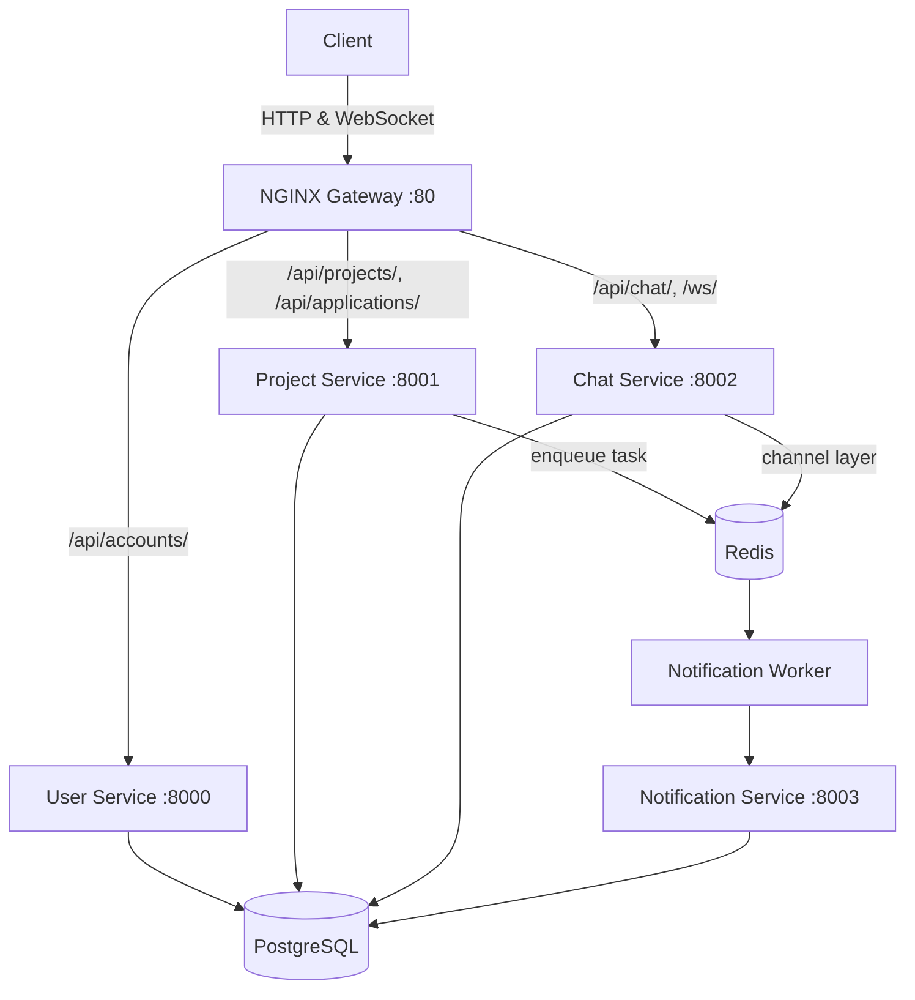

# FreelanceHub

A polyrepo microservices backend for a freelance marketplace — built to practice the same architectural patterns used in real-world distributed systems: independent services, stateless authentication, async task processing, and container orchestration.

## Architecture



Each service owns its own database (`userservice_db`, `projectservice_db`, `chatservice_db`, `notificationservice_db`), runs independently, and communicates with the others only through HTTP or Redis — never by importing each other's code directly.

## Tech Stack

- **Backend:** Django, Django REST Framework
- **Auth:** JSON Web Tokens (`djangorestframework-simplejwt`), validated independently by every service using a shared secret
- **Real-time:** Django Channels + Daphne (WebSocket chat)
- **Async tasks:** Celery + Redis (email notifications, decoupled from the request/response cycle)
- **Database:** PostgreSQL (one logical database per service)
- **Infrastructure:** Docker, Docker Compose, NGINX (reverse proxy / API gateway)

## Features

- **Stateless cross-service authentication** — a user logs in once via User Service; every other service independently verifies the JWT without a shared session store
- **Role-based permissions** — clients post projects, freelancers apply; each endpoint enforces this server-side
- **Full project lifecycle** — post → freelancers apply → client accepts one → project auto-transitions to `in_progress` → every other pending application is automatically rejected in a single bulk update
- **Real-time chat** — authenticated WebSocket connections scoped to a conversation between two specific users
- **Async email notifications** — triggered on key events (e.g. project created), processed by a separate Celery worker so the API response never waits on email delivery
- **One-command deployment** — `docker compose up` builds and runs all 4 services, Postgres, Redis, the Celery worker, and the NGINX gateway together

## API Overview

| Service | Method | Endpoint | Access |
|---|---|---|---|
| User | POST | `/api/accounts/register/` | Public |
| User | POST | `/api/accounts/login/` | Public |
| User | GET | `/api/accounts/me/` | Authenticated |
| Project | GET | `/api/projects/` | Public |
| Project | POST | `/api/projects/` | Client only |
| Project | GET/PUT/PATCH/DELETE | `/api/projects/<id>/` | Public read, owner write |
| Project | POST | `/api/projects/<id>/applications/` | Freelancer only |
| Project | GET | `/api/projects/<id>/applications/` | Project owner only |
| Project | POST | `/api/applications/<id>/accept/` | Project owner only |
| Project | POST | `/api/applications/<id>/reject/` | Project owner only |
| Chat | GET | `/api/chat/messages/<user_id_1>/<user_id_2>/` | Either participant |
| Chat | WS | `/ws/chat/<user_id_1>/<user_id_2>/?token=<jwt>` | Either participant |

## Running Locally

**Requirements:** Docker Desktop

```bash
git clone https://github.com/MohammadReza8632/freelancehub.git
cd freelancehub
```

Create a `.env` file in the project root:
```
SECRET_KEY=your-secret-key
POSTGRES_USER=your-db-user
POSTGRES_PASSWORD=your-db-password
```

Then:
```bash
docker compose build
docker compose up
```

The API is now available at `http://localhost/api/...`

## Project Structure

```
freelancehub/
├── user-service/          # Auth, registration, JWT issuing
├── project-service/       # Projects + applications
├── chat-service/          # Real-time WebSocket chat
├── notification-service/  # Async email via Celery
├── gateway/                # NGINX reverse-proxy config
└── docker-compose.yml      # Orchestrates the whole system
```

## Author

Mohammadreza — [GitHub](https://github.com/MohammadReza8632)
